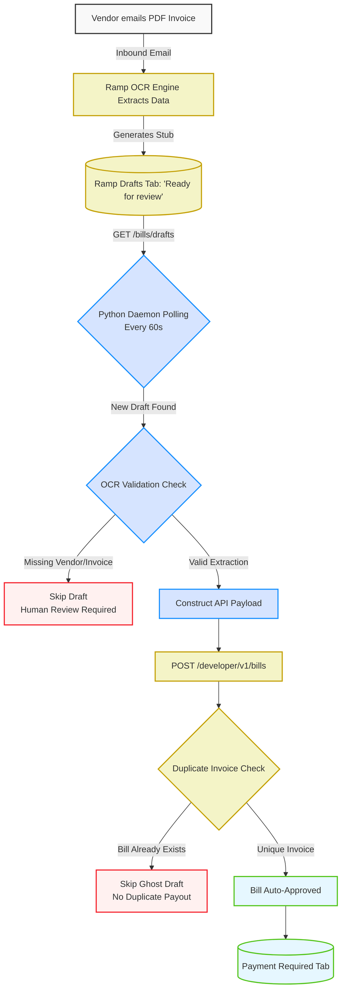

<div align="center">
  <h1>⚡ Ramp Draft-to-Paid Pipeline</h1>
  <p><b>A highly resilient, zero-touch Accounts Payable automation daemon for Ramp.</b></p>
  
  <a href="https://github.com/Vamshi868876/ramp-draft-to-paid-pipeline/blob/main/LICENSE">
    
  </a>
  <a href="https://python.org">
    
  </a>
  <a href="https://ramp.com">
    
  </a>
</div>

<br>

> **The Problem:** Ramp's AI successfully extracts OCR data from emailed invoices but leaves them trapped as `Ready for review` drafts. Ramp's API actively blocks developers from automating the approval of these drafts.
> 
> **The Solution:** This pipeline bypasses the UI restriction by polling for new drafts, safely validating the AI's OCR extraction, and programmatically constructing **brand new, auto-approved bills** using the exact extracted data—achieving 100% hands-free AP automation.

---

## 🏗️ Architecture & Flowchart

The system operates as an infinite background daemon (`main.py`) running a strict 60-second polling cycle. It implements a resilient **2-Track Flow** to gracefully handle Ramp's internal Duplicate Invoice checking.



---

## ✨ Core Features

*   🤖 **Zero-Touch Processing:** Vendors email invoices, and they instantly appear in your "Payment Required" queue without a single human click.
*   🛡️ **OCR Validation Layer:** If Ramp's native AI fails to confidently read an invoice number or vendor ID, the daemon safely skips the invoice to prevent malformed API requests.
*   👻 **Ghost Draft Resolution:** Ramp's API blocks the deletion of email drafts (`405 Method Not Allowed`). The daemon circumvents this by catching HTTP `400 Bad Request` duplicate errors and safely ignoring historical "ghost" drafts without crashing.
*   🔄 **Resilient Polling:** Uses the lightweight `schedule` library to manage API limits and ensure continuous background operation without memory leaks.

---

## 🚀 Getting Started

### Prerequisites
*   Python 3.9+
*   Ramp Developer API Credentials (Client ID, Client Secret)
*   OAuth Scopes: `bills:read`, `bills:write`

### Installation

1. **Clone the repository:**
   ```bash
   git clone https://github.com/Vamshi868876/ramp-draft-to-paid-pipeline.git
   cd ramp-draft-to-paid-pipeline
   ```

2. **Install dependencies:**
   ```bash
   pip install -r requirements.txt
   ```

3. **Configure Environment Variables:**
   Create a `.env` file in the root directory and add your Ramp API credentials:
   ```env
   RAMP_CLIENT_ID=your_client_id_here
   RAMP_CLIENT_SECRET=your_client_secret_here
   ```

### Running the Daemon
To start the continuous background worker, simply execute:
```bash
python main.py
```
The script will authenticate, scan the `/drafts` endpoint, and begin processing in an infinite 60-second loop.

---

## 📜 License & Authorship

This project is licensed under the MIT License - see the [LICENSE](LICENSE) file for details.

**Architect / Author:** Vamshi Batthula  
**Contact:** batthulavamshi740@gmail.com
